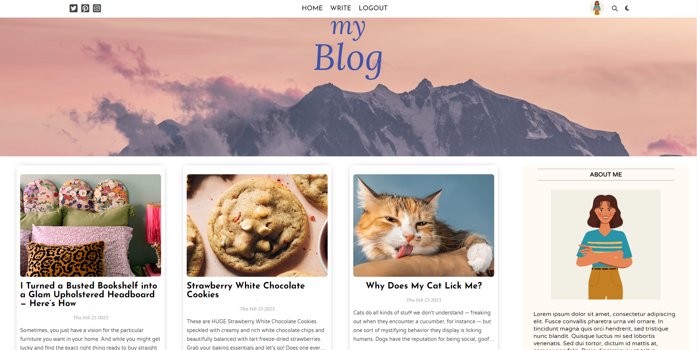
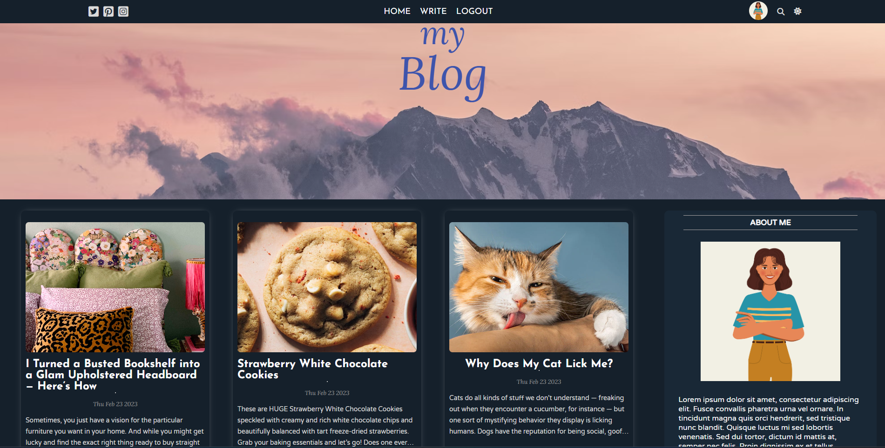
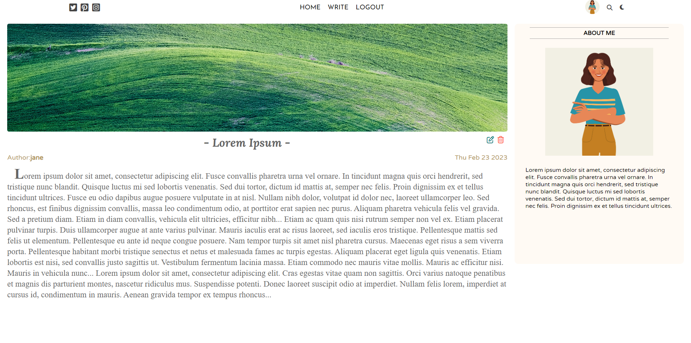
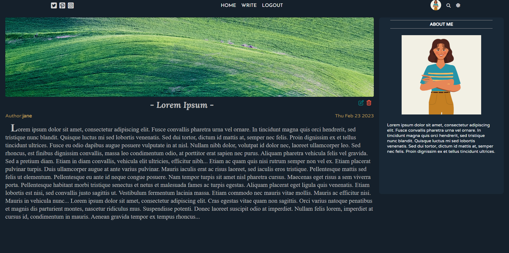
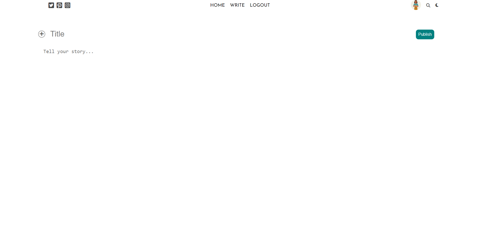
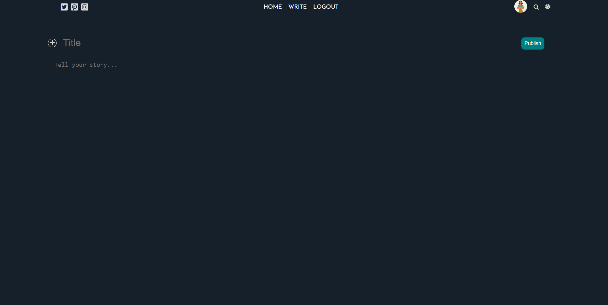
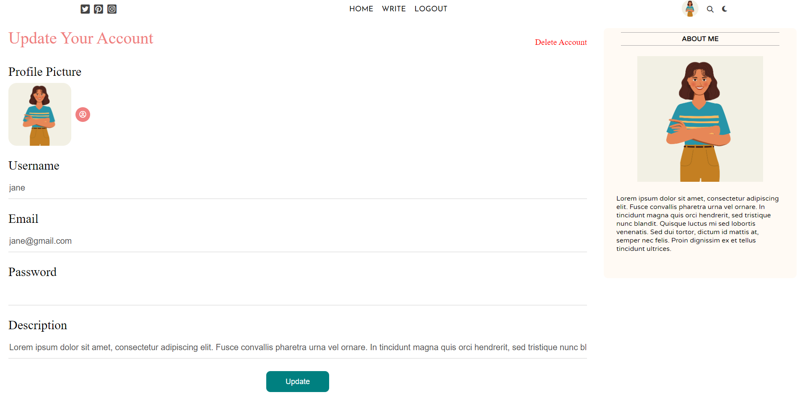
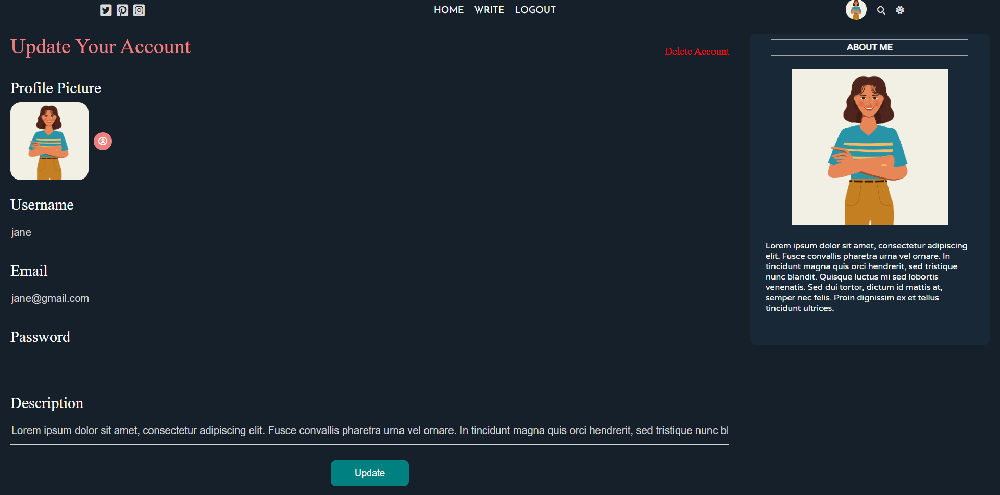
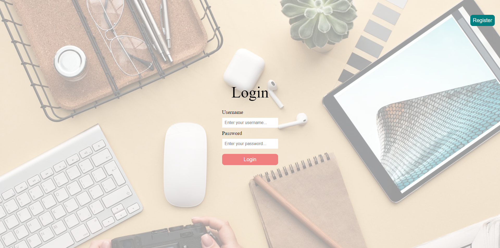
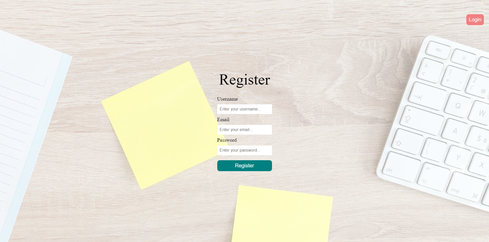

# Blog App

This is a fullstack blog application named ***myBlog***. In this application,
- you can login, logout or create an account,
- you can share a blog post,
- you can edit or delete your post,
- you can change your profile picture,
- you can update your username, email, password and user description,
- you can delete your account,
- you can change theme,
- also you can see other posts on home page.

## Technologies which I used

- React.js
- Node.js
- Express.js
- REST API
- MongoDB

You can look over the server side of this app in [here](https://github.com/eneskaya12/blog-app-api).

## Screenshots

> Home page of application in light & dark theme

> Single post page of application in light & dark theme

> Write page of application in light & dark theme

> Settings page of application in light & dark theme

> Login & register pages of application

